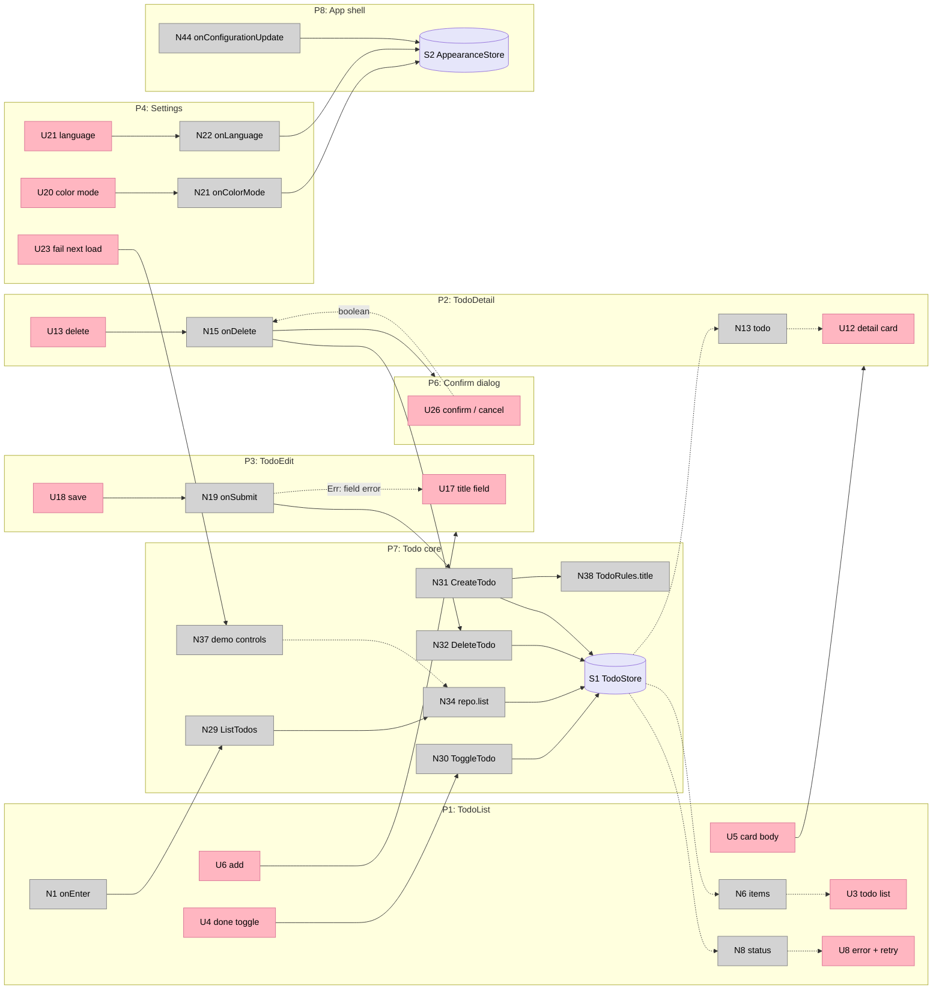

# Hero Todo — Breadboard

Second half of the kicked-off pitch (with [[shaping]]). The tables are the truth; the Mermaid
diagram is a view. Affordance IDs (`U[N]`, `N[N]`, `S[N]`) are the traceability anchors for
`/ba-pitch-analyzer` tasks and commit messages.

## Places

| # | Place | Description |
|---|---|---|
| P1 | TodoList | First screen. List prototype (ui-layer.md §2.9). |
| P2 | TodoDetail | Detail prototype; route param is the id only (§2.6). |
| P3 | TodoEdit | Form prototype; create (no id) or rename (id). Same affordances → one place. |
| P4 | Settings | App-level screen in `app/screens/Settings`: color mode, language, demo knobs, gallery link (§4.8). |
| P5 | Gallery | App-level screen in `app/screens/Gallery`: catalog × six states (§1.7, §1.8). |
| P6 | Confirm dialog | Blocking overlay opened by a ViewModel via `OverlayHost`; `OverlayId.ConfirmDelete` / `ConfirmDiscard` (§2.7). |
| P7 | Todo core | The in-process "backend": use cases, fake repository, `TodoStore` (index.md §4, §5). |
| P8 | App shell | `EntryAbility`, AppStartup task, the single `Navigation` host, runtime stores (index.md §7, ui-layer.md §2.6, §4.7). |

Back on P2, P4 and P5 is `ScreenScaffold`'s default (NavDestination pop) and gets no row. Only
P3's back has its own wiring (U19), and P2's "deleted" state has an explicit back action (U14 → N46).
Toast is non-blocking, so it is an output (U10), not a place.

## UI Affordances

| # | Place | Component | Affordance | Control | Wires Out | Returns To |
|---|---|---|---|---|---|---|
| U1 | P1 | ScreenScaffold action | settings button | tap | → N10 | — |
| U2 | P1 | AppText | item count (plural) | render | — | ← N7 |
| U3 | P1 | ListScaffold + Repeat of TodoCard | todo list (Ready) | render | — | ← N6 |
| U4 | P1 | TodoCard | done toggle | tap | → N3 | — |
| U5 | P1 | TodoCard | card body | tap | → N4 | — |
| U6 | P1 | AppButton primary | add button | tap | → N5 | — |
| U7 | P1 | Skeleton | loading branch | render | — | ← N8 |
| U8 | P1 | ErrorState | error branch + retry | tap retry | → N2 | ← N8 |
| U9 | P1 | EmptyState | empty branch + "add your first" | tap | → N5 | ← N8 |
| U10 | P1 | OverlayHost toast | "Deleted" toast | render | — | ← N28 |
| U11 | P2 | ScreenScaffold action | edit button | tap | → N16 | — |
| U12 | P2 | AppCard + AppText + Badge | title, done badge, created text (Ready) | render | — | ← N13, N14 |
| U13 | P2 | AppButton danger (loading) | delete button | tap | → N15 | — |
| U14 | P2 | EmptyState | "this item was deleted" + back (Empty) | tap | → N46 | ← N17 |
| U15 | P2 | Skeleton | loading branch | render | — | ← N17 |
| U16 | P2 | ErrorState | error branch + retry | tap retry | → N12 | ← N17 |
| U17 | P3 | Field (FieldType.Text) | title field + inline error | type | → N18 | ← N18, N19 |
| U18 | P3 | FormFrame submit (AppButton, loading) | save, disabled unless valid | tap | → N19 | ← N18 |
| U19 | P3 | ScreenScaffold back | back, dirty-aware | tap / system back | → N20 | — |
| U20 | P4 | Field (FieldType.Select) | color mode: Light / Dark / System | select | → N21 | ← N25 |
| U21 | P4 | Field (FieldType.Select) | language: English / Tiếng Việt | select | → N22 | ← N25 |
| U22 | P4 | Field (FieldType.Toggle) | demo: slow load | toggle | → N23 | ← N25 |
| U23 | P4 | Field (FieldType.Toggle) | demo: fail next load | toggle | → N24 | ← N25 |
| U24 | P4 | AppCard row | open gallery | tap | → N26 | — |
| U25 | P5 | Gallery sections | every catalog primitive × six states | render | — | static sample props |
| U26 | P6 | OverlayHost dialog | message + confirm + cancel | tap | → boolean to caller | ← N27 |
| U27 | P4 | AppButton secondary | demo: reset data (added in B4) | tap | → N47 | — |

## Code Affordances

| # | Place | Component | Affordance | Control | Wires Out | Returns To |
|---|---|---|---|---|---|---|
| N1 | P1 | TodoListViewModel | `onEnter()` first load, once | call (onAppear) | → N29 | — |
| N2 | P1 | TodoListViewModel | `onRetry()` | call | → N29 | — |
| N3 | P1 | TodoListViewModel | `onToggle(id)` | call | → N30 | — |
| N4 | P1 | TodoListViewModel | `onOpen(id)` | call | → P2 (push `TodoDetail`, id) | — |
| N5 | P1 | TodoListViewModel | `onAdd()` | call | → P3 (push `TodoEdit`) | — |
| N6 | P1 | TodoListViewModel | `items` @Computed, newest first | observe | — | ← S1 → U3 |
| N7 | P1 | TodoListViewModel | `countText` @Computed (`$r` plural of `items.length`) | observe | — | → U2 |
| N8 | P1 | TodoListViewModel | `status` @Computed | observe | — | → AsyncBoundary picks U7 / U8 / U9 / U3 |
| N9 | P1 | TodoListViewModel | `onShown()` refresh — silent when `S1.loaded`, full load otherwise | call (onShown) | → N29 | — |
| N10 | P1 | TodoListViewModel | `onSettings()` | call | → P4 | — |
| N11 | P2 | TodoDetailViewModel | `onEnter()` ensure loaded | call | → N29 if `!S1.loaded` | — |
| N12 | P2 | TodoDetailViewModel | `onRetry()` | call | → N29 | — |
| N13 | P2 | TodoDetailViewModel | `todo` @Computed (`store.byId(routeId)`) | observe | — | ← S1 → U12 |
| N14 | P2 | TodoDetailViewModel | `createdAtText` @Computed | observe | → N40 | → U12 |
| N15 | P2 | TodoDetailViewModel | `onDelete()` | call | → N27 → N32 → N28 → pop | — |
| N16 | P2 | TodoDetailViewModel | `onEdit()` | call | → P3 (push `TodoEdit`, id) | — |
| N17 | P2 | TodoDetailViewModel | `status` @Computed (Empty when todo null and loaded) | observe | — | → U14 / U15 / U16 / U12 |
| N18 | P3 | TodoEditViewModel.form (FormViewModel) | `title` @Trace · `isDirty` / `isValid` @Computed | write / observe | → N38 | → U17, U18 |
| N19 | P3 | TodoEditViewModel | `onSubmit()` | call | → N31 or N33; Err → N39 → `setFieldError` → U17; Ok → pop | — |
| N20 | P3 | TodoEditViewModel | `onBackPressed()` | call | `isDirty` → N27 → pop or stay | — |
| N21 | P4 | SettingsViewModel | `onColorMode(mode)` | call | → `applicationContext.setColorMode` · write S2 | — |
| N22 | P4 | SettingsViewModel | `onLanguage(tag)` | call | → `i18n.System.setAppPreferredLanguage` · write S2 | — |
| N23 | P4 | SettingsViewModel | `onSlowLoad(on)` | call | → N37 | — |
| N24 | P4 | SettingsViewModel | `onFailNext(on)` | call | → N37 | — |
| N25 | P4 | SettingsViewModel | selected states @Computed | observe | — | ← S2, N37 → U20–U23 |
| N26 | P4 | SettingsViewModel | `onGallery()` | call | → P5 | — |
| N27 | P6 | OverlayHost | `confirm(OverlayId)` via overlayRegistry | call ← N15, N20 | → U26 | → boolean to caller |
| N28 | P6 | OverlayHost | `toast(Resource)` | call ← N15 | → U10 | — |
| N29 | P7 | ListTodos(repo) | use case | call | → N34 | → Result |
| N30 | P7 | ToggleTodo(repo, id) | use case | call | → N35 | → Result |
| N31 | P7 | CreateTodo(repo, clock, idGen, input) | use case | call | → N38, → N35 | → Result (Err carries ErrorCode) |
| N32 | P7 | DeleteTodo(repo, id) | use case | call | → N36 | → Result |
| N33 | P7 | RenameTodo(repo, id, title) | use case | call | → N38, → N35 | → Result |
| N34 | P7 | InMemoryTodoRepository | `list()` (seed; honours N37 delay / fail-once) | call | write S1 `todos`, `loaded` | → Result |
| N35 | P7 | InMemoryTodoRepository | `add()` / `update()` | call | write S1 | → Result |
| N36 | P7 | InMemoryTodoRepository | `remove()` | call | write S1 | → Result |
| N37 | P7 | TodoDemoControls | `delayMs`, `failNextLoad`, `reset()` | write ← N23, N24, N47 | `reset()` clears S1 (`todos = []`, `loaded = false`) | → N34, N25 |
| N38 | P7 | TodoRules | `title(value)` | call | — | → ErrorCode or null |
| N39 | P8 | shared/uikit/i18n ErrorText | `Map<ErrorCode, Resource>` | read ← N19 | — | → U17 |
| N40 | P8 | shared/utils/format | `formatDate(ms, locale)` | call ← N14 | — | → N14 |
| N41 | P8 | EntryAbility | `loadContent` callback: `ThemeControl.setDefaultTheme`, capture UIContext | call | write S3 | — |
| N42 | P8 | AppStartup task | `AssembleModules`: build TodoModule (fake repo, Clock, IdGen), connect S1, S2 | call (startup_config) | write S4 | — |
| N43 | P8 | Index.ets | `Navigation` + `NavPathStack` (`NavigationMode.Auto`); route_map resolves name → builder | mechanism (single host for every push in N4, N5, N10, N16, N26) | → N45 | — |
| N44 | P8 | EntryAbility | `onConfigurationUpdate(cfg)` | call (system) | write S2 | — |
| N45 | P8 | XPage builders | `TodoListPageBuilder` … construct VM from S4; NavDestination lifecycle | call ← N43 | → N1, N9, N11 | — |
| N46 | P2 | TodoDetailViewModel | `onBack()` (added in B4) | call ← U14 | → pop to P1 | — |
| N47 | P4 | SettingsViewModel | `onResetData()` (added in B4) | call ← U27 | → N37 `reset()` | — |

## Data Stores

| # | Place | Store | Description |
|---|---|---|---|
| S1 | P7 | `TodoStore` | `@ObservedV2`: `@Trace todos: Todo[]`, `@Trace loaded: boolean`. Written only by N34–N36 (and cleared by N37 `reset()`); read by N6, N13, N17. |
| S2 | P8 | `AppearanceStore` | `AppStorageV2`: colorMode, language, fontSizeScale. Written by N44, N21, N22; read by N25. |
| S3 | P8 | UIContext holder | `shared/runtime`. Written by N41; read by N27, N28. |
| S4 | P8 | `AppModules` | `adapters/wiring`. Written by N42; read by N45. |

## Wiring Diagram

## Wiring Verification (B4)

| Check | Result |
|---|---|
| Every U that displays data has an incoming wire | ✅ U2, U3, U7–U10, U12, U14–U18, U20–U23, U26 all fed. U25 renders fixed sample props (static, by design). |
| Every N has Wires Out or Returns To | ✅ N1–N47. |
| Every S is read | ✅ S1 ← N6, N13, N17 · S2 ← N25 · S3 ← N27, N28 · S4 ← N45. |
| Navigation mechanisms wire to Places, not to the host | ✅ N4, N5, N10, N16, N26 → P2 / P3 / P4 / P5. N43 is recorded as the single host (a doc-mandated part), not as a hop in those wires. |
| N with external side effects has a store | ✅ N21 / N22 change app configuration → mirrored in S2 (also fed by N44). |

Smells found and fixed inline:
- **View touching navigation.** U14 ("deleted" → back) wired straight to `pop`, which is a View reaching for the stack. Fixed: **N46** `TodoDetailViewModel.onBack()`; the EmptyState action fires an `@Event`, the ViewModel pops.
- **Unreachable branch.** The Error branch of P1 (U8) could not be demonstrated on device: the seed is loaded once, "fail next load" only affects a *load*, and no path re-loaded. Fixed: **U27 / N47** "reset data" on Settings calls N37 `reset()`, which clears S1 and drops `loaded`; N9 then performs a full load on return (silent refresh only when `S1.loaded`). Sequence for R8: *fail next load* + *reset data* → back → Loading → Error → Retry → Ready. Empty stays reachable by deleting every todo.
- **Double-counted wire.** N43 originally listed "call ← N4, N5, …" while those N already wired to Places. Its Control column now says *mechanism (single host)*.

## Slicing (B5)

| # | Slice | Mechanism (parts · affordances) | Demo |
|---|---|---|---|
| V1 | List boots on the four-file pattern | A1 (types) · A2 `Todo`, `ListTodos`, ports · A3 fake repo + `TodoStore`, seed · A4 `TodoList` Page/VM/view/parts + `TodoCard` · A5 tokens, `AppText`, `AppButton`, `ScreenScaffold`, `AsyncBoundary` + `Skeleton` + statusRegistry, `ListScaffold` · A6 `EntryAbility`, startup task, `Index` host · A7 base strings/plurals/colors/floats, `route_map`, `startup_config`, `configuration.json` · A11 runtime holders — U2, U3, U7 · N1, N6, N7, N8, N29, N34 · N41–N43, N45 · S1, S3, S4 | "Cold start → skeleton → seeded list of three todos with the count text; flip system dark mode → whole screen recolors." |
| V2 | Detail by id | A4 `TodoDetail` · A5 `AppCard`, `Badge`, `EmptyState`, `ErrorState` · A11 `formatDate` — U5, U12, U14, U15, U16 · N4, N11, N12, N13, N14, N17, N40, N46 | "Tap a card → detail with created date in the current locale; kill the process on the detail screen, relaunch from recents → 'This item was deleted' + Back." |
| V3 | Create with validation, silent return | A1 `ErrorCode` · A2 `TodoRules`, `CreateTodo`, `Clock`/`IdGen` · A4 `TodoEdit` (create) · A5 `FormFrame`, `Field` + fieldRegistry (Text), ErrorText table — U6, U9, U17, U18 · N5, N9, N18, N19, N31, N35, N38, N39 | "Add → submit empty → 'Title is required' under the field; type → Save enables, spinner while saving, back on the list with the new item on top and no loading flash." |
| V4 | Toggle, rename, delete with confirm | A2 `ToggleTodo`, `RenameTodo`, `DeleteTodo` · A4 `TodoEdit` (rename), dirty back · A5 `OverlayHost` + overlayRegistry, toast — U4, U10, U11, U13, U19, U26 · N3, N15, N16, N20, N27, N28, N30, N32, N33, N36 | "Toggle done in the list; Edit → change title → back → 'Discard changes?'; Delete → confirm → toast 'Deleted' → list updated in place." |
| V5 | Settings: color mode + language, live | A6 `Settings` · A5 fieldRegistry (Select) · A7 `vi_VN` strings + plurals complete, `dark` colors · A11 `AppearanceStore` — U1, U20, U21 · N10, N21, N22, N25, N44 · S2 | "Settings → Dark → app dark immediately; → Tiếng Việt → every string, the count and the date switch on every open screen." |
| V6 | Four states on demand | A3 demo knobs · A5 fieldRegistry (Toggle) — U8, U22, U23, U27 · N2, N23, N24, N37, N47 | "Fail next load + reset data → back → skeleton → error → Retry → list. Slow load → visible skeleton on each fresh load." |
| V7 | Catalog complete + Gallery | A5 remaining catalog (`AppIcon`, `Chip`, `Avatar`, `Spinner`, `Divider`, `Spacer`), modifiers with six states, touch target, `accessibilityText`, `.id()` everywhere, themeRegistry · A6 `Gallery` — U24, U25 · N26 | "Open Gallery → every primitive in six states; flip dark mode and max font size → nothing clips, every control ≥ touch target." |
| V8 | Enforce rules L1–L11 | A8 hvigor task + rule table | "Add a hex color to a .ets → build fails with L1; add an unused string key → L11 warning; remove both → green." |
| V9 | Tests + doc feedback | A9 instrumented (four states per screen via injected fake, restore after kill, language across the stack, ids) + local (rules, format, plural) · A10 §8 answers folded into ui-layer.md, `docs/ui-layer-trace.md` | "Both suites green; open the trace index, every §-row links to a real file; §8 has five answers." |

Order: V1 → V2 → V3 → V4 are sequential (each extends the todo flow). V5, V7 and V8 depend only on V1 and can run alongside V2–V4. V6 needs V3 (the list load path) and V5 (Settings). V9 needs everything.

Device-free unit tests for `TodoRules` and `formatDate` land with V3 and V2 respectively; V9 carries the instrumented suites because they need V6's knobs.

## Kickoff-ready

- ✅ appetite set (~6 weeks)
- ✅ all spikes resolved (U1–U5; residual device checks assigned to V2, V5, V9)
- ✅ rabbit holes listed (RH1–RH7)
- ✅ fit check clean (R0–R20)
- ✅ 9 slices (≤ 9)
