# Retro Todo — Breadboard

Designed from the parts in [[shaping]] (Shape A) on top of the existing template entry — `EntryAbility`
loading `pages/Index` — which stays the entry point (A6). Affordance IDs (U, N, S) are the traceability
anchors for tasks and commits.

## Fat Marker Sketch (B0)

```
P1 Lists                             P2 List
┌─────────────────────────────┐      ┌─────────────────────────────┐
│ MY LISTS       [+ NEW LIST] │      │ [←] GROCERIES               │
│ ┏━━━━━━━━━━━━━━━━━━━━━━━━┓  │      │ [ New item...     ] [ ADD ] │
│ ┃ GROCERIES     [✎] [✕] ┃█ │      │ ┏━━━━━━━━━━━━━━━━━━━━━━━━┓  │
│ ┃ 1/3 done               ┃█ │      │ ┃ [ ] Bread          [✕] ┃█ │
│ ┗━━━━━━━━━━━━━━━━━━━━━━━━┛█ │      │ ┗━━━━━━━━━━━━━━━━━━━━━━━━┛█ │
│ ┏━━━━━━━━━━━━━━━━━━━━━━━━┓  │      │ ┏━━━━━━━━━━━━━━━━━━━━━━━━┓  │
│ ┃ WORK          [✎] [✕] ┃█ │      │ ┃ [ ] Buy eggs       [✕] ┃█ │
│ ┃ 1/2 done               ┃█ │      │ ┗━━━━━━━━━━━━━━━━━━━━━━━━┛█ │
│ ┗━━━━━━━━━━━━━━━━━━━━━━━━┛█ │      │ ┏━━━━━━━━━━━━━━━━━━━━━━━━┓  │
│ ┏━━━━━━━━━━━━━━━━━━━━━━━━┓  │      │ ┃ [x] Buy milk       [✕] ┃█ │ ← struck through,
│ ┃ WEEKEND       [✎] [✕] ┃█ │      │ ┗━━━━━━━━━━━━━━━━━━━━━━━━┛█ │   inkMuted on surfaceDone
│ ┃ No items               ┃█ │      └─────────────────────────────┘
│ ┗━━━━━━━━━━━━━━━━━━━━━━━━┛█ │
└─────────────────────────────┘

P3 List Name Dialog              P4 Confirm Delete Dialog
┏━━━━━━━━━━━━━━━━━━━━━━━━┓       ┏━━━━━━━━━━━━━━━━━━━━━━━━━━━━┓
┃ NEW LIST / RENAME LIST  ┃█      ┃ Delete "Groceries" and its  ┃█
┃ [ Name...            ]  ┃█      ┃ 3 items?                    ┃█
┃ Name can't be empty     ┃█      ┃      [ CANCEL ] [ DELETE ]  ┃█
┃    [ CANCEL ] [ SAVE ]  ┃█      ┗━━━━━━━━━━━━━━━━━━━━━━━━━━━━┛█
┗━━━━━━━━━━━━━━━━━━━━━━━━┛█
```

## Places

| # | Place | Kind | Description |
|---|---|---|---|
| P1 | Lists | screen (root) | Every list as a card: create, open, rename, delete |
| P2 | List | screen, param `listId` | One list's items as cards, open above done: add, toggle, delete |
| P3 | List Name Dialog (Create · Rename) | modal | One name field, for creating a list or renaming one |
| P4 | Confirm Delete Dialog (List · Item) | modal | Confirms deleting a list with its items, or one item |
| P5 | App runtime | non-UI | Shell, domain, in-memory repository and `TodoStore` |

P1–P4 each carry UI affordances, so each becomes a screen in the spec. P3 is a form (`docs/ui-layer.md`
§2.9, always Ready); P3 and P4 are overlays that a ViewModel opens (§2.7).

## UI Affordances

| ID | Place | Component | Affordance | Control | Wires Out | Returns To |
|----|-------|-----------|------------|---------|-----------|------------|
| U1 | P1 | RetroButton (primary) | "+ NEW LIST" | tap | → N16 | — |
| U2 | P1 | RetroCard | list card: name + progress ("1/3 done"; "No items" when empty), newest-created first | render | — | — |
| U3 | P1 | RetroCard | card body | tap | → N17 | — |
| U4 | P1 | RetroButton (icon) | ✎ rename | tap | → N18 | — |
| U5 | P1 | RetroButton (icon) | ✕ delete | tap | → N19 | — |
| U6 | P1 | EmptyState | "No lists yet" + "CREATE YOUR FIRST LIST" | render · tap | → N16 | — |
| U7 | P2 | RetroButton (icon) | ← back (system Back does the same) | tap | → N27 | — |
| U8 | P2 | AppText | the list's name as the title | render | — | — |
| U9 | P2 | RetroField | new-item field; the keyboard's submit adds too | type · submit | → N24 | — |
| U10 | P2 | RetroButton (primary) | "ADD" | tap | → N24 | — |
| U11 | P2 | RetroField | field error "Title can't be empty" | render | — | — |
| U12 | P2 | RetroCard + RetroCheck | item card in `ItemOrder`. Open: `ink` text on `surface`, empty box. Done: struck through in `inkMuted` on `surfaceDone`, checked box | render | — | — |
| U13 | P2 | RetroCard | item card body (box + title) | tap | → N25 | — |
| U14 | P2 | RetroButton (icon) | ✕ delete item | tap | → N26 | — |
| U15 | P2 | EmptyState | "No items yet" + "Add your first item above" | render | — | — |
| U16 | P3 | RetroDialog | title "NEW LIST" / "RENAME LIST" | render | — | — |
| U17 | P3 | RetroField | name field (pre-filled when renaming) | type | → N20 | — |
| U18 | P3 | RetroField | field error "Name can't be empty" | render | — | — |
| U19 | P3 | RetroButton (primary) | "SAVE" | tap | → N20 | — |
| U20 | P3 | RetroButton | "CANCEL" | tap | → P1 | — |
| U21 | P4 | RetroDialog | `Delete "<list>" and its <n> items?` (plural resource) / `Delete "<item>"?` | render | — | — |
| U22 | P4 | RetroButton (danger) | "DELETE" — confirms the pending delete | tap | → N19 · N26 | — |
| U23 | P4 | RetroButton | "CANCEL" — back to the calling screen | tap | → P1 · P2 | — |

## Code Affordances

| ID | Place | Part | Affordance | Control | Wires Out | Returns To |
|----|-------|------|------------|---------|-----------|------------|
| N1 | P5 | A6 | `EntryAbility.onWindowStageCreate` → `loadContent('pages/Index')`; in its callback, `setColorMode(COLOR_MODE_LIGHT)` and capture the `UIContext` | lifecycle | → N2 | — |
| N2 | P5 | A6 | `Index` — the single V2 `Navigation` + `NavPathStack`; builder route table `List` → P2; assembles `TodoModule` once; root content P1 | build | → N3, → P1 | — |
| N3 | P5 | A6 | `TodoModule` — builds the repository, the store and the six use cases, and hands them to the ViewModels | construct | → N12, → N13 | — |
| N4 | P5 | A1 | `TodoRules.checkListName(name)` · `checkItemTitle(title)` — trim; blank → `ErrorCode` | call | — | → N6, N7, N9 |
| N5 | P5 | A1 | `ItemOrder.sort(items)` — open before done; `createdAt` descending within each group | call | — | → N22 |
| N6 | P5 | A1 | `CreateList(name)` → `Result` | call | → N4, → N12 | → N20 |
| N7 | P5 | A1 | `RenameList(listId, name)` → `Result` | call | → N4, → N12 | → N20 |
| N8 | P5 | A1 | `DeleteList(listId)` — the list and its items → `Result` | call | → N12 | → N19 |
| N9 | P5 | A1 | `AddItem(listId, title)` → `Result` | call | → N4, → N12 | → N24 |
| N10 | P5 | A1 | `ToggleItem(itemId)` → `Result` | call | → N12 | → N25 |
| N11 | P5 | A1 | `DeleteItem(itemId)` → `Result` | call | → N12 | → N26 |
| N12 | P5 | A2 | `InMemoryTodoRepository` — `createList` · `renameList` · `deleteList` · `addItem` · `setDone` · `deleteItem`; the store's only writer | write | → S1, → S2 | — |
| N13 | P5 | A2 | `InMemoryTodoRepository.seed()` on cold start — Groceries (Buy milk ✓, Buy eggs, Bread) · Work (Book meeting room ✓, Send weekly report) · Weekend (no items); lists created Weekend → Work → Groceries, items in the order listed | write | → S1, → S2 | — |
| N14 | P1 | A3 | `ListsViewModel.cards` `@Computed` — S1 newest-created first, progress counted from S2 | observe | — | → U2 |
| N15 | P1 | A3 | `ListsViewModel.status` `@Computed` — Loading (first frame) → Empty · Ready | observe | — | → U2, U6 |
| N16 | P1 | A3 | `ListsViewModel.onNew()` | call | → P3 (Create) | → U16 |
| N17 | P1 | A3 | `ListsViewModel.onOpen(listId)` — `pushPathByName('List', listId)` | call | → P2 | — |
| N18 | P1 | A3 | `ListsViewModel.onRename(listId)` | call | → P3 (Rename) | → U16, U17 |
| N19 | P1 | A3 | `ListsViewModel.onDelete(listId)` — opens P4; on DELETE calls N8 | call | → P4, → N8 | → U21 |
| N20 | P3 | A3 | `ListNameForm.submit()` — `Ok` closes P3; `Err` shows the error | call | → N6 · N7, → P1 | → U18 |
| N21 | P2 | A4 | `ListViewModel.title` `@Computed` — the list's name from S1 | observe | — | → U8 |
| N22 | P2 | A4 | `ListViewModel.items` `@Computed` — N5 over the S2 items of `listId` | observe | → N5 | → U12 |
| N23 | P2 | A4 | `ListViewModel.status` `@Computed` — Loading (first frame) → Empty · Ready | observe | — | → U12, U15 |
| N24 | P2 | A4 | `ListViewModel.onAdd()` — `Ok` clears the field; `Err` shows the error | call | → N9 | → U11 |
| N25 | P2 | A4 | `ListViewModel.onToggle(itemId)` | call | → N10 | — |
| N26 | P2 | A4 | `ListViewModel.onDeleteItem(itemId)` — opens P4; on DELETE calls N11 | call | → P4, → N11 | → U21 |
| N27 | P2 | A4 | `ListViewModel.onBack()` — `pop()` | call | → P1 | — |

## Data Stores

| # | Place | Store | Description | Written by | Read by |
|---|---|---|---|---|---|
| S1 | P5 | `TodoStore.lists` | `@Trace` array of `TodoList` (id, name, createdAt) | N12, N13 | N14, N15, N21 |
| S2 | P5 | `TodoStore.items` | `@Trace` array of `TodoItem` (id, listId, title, done, createdAt) | N12, N13 | N14, N22, N23 |

## Retro Kit (A5)

| Piece | Used by | Notes |
|---|---|---|
| Color tokens — `background` · `surface` · `surfaceDone` · `ink` · `inkMuted` · `brand` · `danger` · `onDanger` | everything | Values and contrast in [[spike-A5-retro-rendering]] |
| Size tokens — border width 2vp · shadow offset 4vp · radius · spacing · font sizes (fp) · minimum touch target | everything | `float.json` |
| `AppText` | U2, U8, U12, U16, U21 | `Resource`-typed text |
| `RetroButton` — primary (`brand`) · danger · plain · icon | U1, U4, U5, U7, U10, U14, U19, U20, U22, U23 | Pressed: the face shifts onto its shadow |
| `RetroCard` — `Stack`: an `ink` block offset by the shadow token behind a 2vp-bordered face | U2, U3, U12, U13, P3, P4 | `surface` and `surfaceDone` variants |
| `RetroCheck` | U12 | 2vp `ink` box; checked = `brand` fill with an `ink` check |
| `RetroField` | U9, U11, U17, U18 | Field + error line |
| `EmptyState` | U6, U15 | Message + optional action |
| `RetroDialog` | P3, P4 | A card-framed custom dialog opened through the captured `UIContext` |

## Wiring Diagram

```mermaid
flowchart TB
    subgraph P5["P5: App runtime"]
        N1["N1: EntryAbility.onWindowStageCreate"]
        N2["N2: Index · Navigation host"]
        N3["N3: TodoModule"]
        N4["N4: TodoRules"]
        N5["N5: ItemOrder.sort"]
        N6["N6: CreateList"]
        N7["N7: RenameList"]
        N8["N8: DeleteList"]
        N9["N9: AddItem"]
        N10["N10: ToggleItem"]
        N11["N11: DeleteItem"]
        N12["N12: InMemoryTodoRepository"]
        N13["N13: seed()"]
        S1[("S1: TodoStore.lists")]
        S2[("S2: TodoStore.items")]
    end

    subgraph P1["P1: Lists"]
        U1["U1: + NEW LIST"]
        U2["U2: list card"]
        U3["U3: card tap"]
        U4["U4: rename icon"]
        U5["U5: delete icon"]
        U6["U6: empty invite"]
        N14["N14: cards @Computed"]
        N15["N15: status @Computed"]
        N16["N16: onNew"]
        N17["N17: onOpen"]
        N18["N18: onRename"]
        N19["N19: onDelete"]
    end

    subgraph P2["P2: List"]
        U7["U7: back"]
        U8["U8: title"]
        U9["U9: new-item field"]
        U10["U10: ADD"]
        U11["U11: title error"]
        U12["U12: item card"]
        U13["U13: item tap"]
        U14["U14: delete icon"]
        U15["U15: empty invite"]
        N21["N21: title @Computed"]
        N22["N22: items @Computed"]
        N23["N23: status @Computed"]
        N24["N24: onAdd"]
        N25["N25: onToggle"]
        N26["N26: onDeleteItem"]
        N27["N27: onBack"]
    end

    subgraph P3["P3: List Name Dialog"]
        U16["U16: dialog title"]
        U17["U17: name field"]
        U18["U18: name error"]
        U19["U19: SAVE"]
        U20["U20: CANCEL"]
        N20["N20: ListNameForm.submit"]
    end

    subgraph P4["P4: Confirm Delete Dialog"]
        U21["U21: message"]
        U22["U22: DELETE"]
        U23["U23: CANCEL"]
    end

    N1 --> N2
    N2 --> N3
    N2 --> P1
    N3 --> N12
    N3 --> N13
    N12 --> S1
    N12 --> S2
    N13 --> S1
    N13 --> S2

    U1 --> N16
    U6 --> N16
    N16 --> P3
    U3 --> N17
    N17 --> P2
    U4 --> N18
    N18 --> P3
    U5 --> N19
    N19 --> P4
    N19 --> N8

    U17 --> N20
    U19 --> N20
    N20 --> N6
    N20 --> N7
    N20 --> P1
    U20 --> P1

    U7 --> N27
    N27 --> P1
    U9 --> N24
    U10 --> N24
    N24 --> N9
    U13 --> N25
    N25 --> N10
    U14 --> N26
    N26 --> P4
    N26 --> N11

    U22 --> N19
    U22 --> N26
    U23 --> P1
    U23 --> P2

    N6 --> N4
    N7 --> N4
    N9 --> N4
    N6 --> N12
    N7 --> N12
    N8 --> N12
    N9 --> N12
    N10 --> N12
    N11 --> N12
    N22 --> N5

    S1 -.-> N14
    S2 -.-> N14
    S1 -.-> N15
    S1 -.-> N21
    S2 -.-> N22
    S2 -.-> N23
    N5 -.-> N22
    N14 -.-> U2
    N15 -.-> U6
    N21 -.-> U8
    N22 -.-> U12
    N23 -.-> U15
    N24 -.-> U11
    N20 -.-> U18
    N16 -.-> U16
    N18 -.-> U16
    N18 -.-> U17
    N19 -.-> U21
    N26 -.-> U21

    classDef ui fill:#ffb6c1,stroke:#d87093,color:#000
    classDef nonui fill:#d3d3d3,stroke:#808080,color:#000
    classDef store fill:#e6e6fa,stroke:#9370db,color:#000
    class U1,U2,U3,U4,U5,U6,U7,U8,U9,U10,U11,U12,U13,U14,U15,U16,U17,U18,U19,U20,U21,U22,U23 ui
    class N1,N2,N3,N4,N5,N6,N7,N8,N9,N10,N11,N12,N13,N14,N15,N16,N17,N18,N19,N20,N21,N22,N23,N24,N25,N26,N27 nonui
    class S1,S2 store
```



## Wiring Verification (B4)

- Every U that displays data has a source: U2 ← N14 · U6 ← N15 · U8 ← N21 · U11 ← N24 · U12 ← N22, N23 · U15 ← N23 · U16 ← N16, N18 · U18 ← N20 · U21 ← N19, N26.
- Every N has Wires Out or Returns To; both stores are read (S1 by N14, N15, N21; S2 by N14, N22, N23).
- Navigation mechanisms (`pushPathByName`, `pop`, opening a custom dialog) are not nodes; handlers wire straight to the Place.
- Fixed during B4: the separate "confirm result" node was removed — DELETE wires back to the pending delete, CANCEL to the calling screen; seeding moved inside the repository, so the store keeps one writer (`docs/index.md` §1, rule 1).
- Invariants the tables encode: only the repository (N12, N13) writes S1/S2; no View touches the store or the `NavPathStack`; the route parameter is the list id.

## Slicing

| # | Slice | Parts | Affordances | Demo |
|---|---|---|---|---|
| V1 | Retro lists on launch | A1 (kernel, entities) · A2 · A3 (display) · A5 · A6 | N1–N3, N12–N15, S1, S2, U2 | "Cold start → MY LISTS shows Groceries 1/3 done, Work 1/2 done, Weekend No items as cream cards with 2vp ink borders and a hard ink shadow. Switch the system to dark mode — the app stays light." |
| V2 | Open a list: done at the bottom | A1 (`ItemOrder`) · A4 (display) · A6 (route) | U3, U7, U8, U12, N5, N17, N21–N23, N27 | "Tap Groceries → Bread and Buy eggs on top, Buy milk last, struck through in brown on a sunk card. Back returns to Lists." |
| V3 | Toggle re-sorts | A1 (`ToggleItem`) · A4 | U13, N10, N25 | "Tap Bread → it drops into the done group, struck through; Lists reads Groceries 2/3 done. Tap it again → it returns above Buy eggs; 1/3 done." |
| V4 | Add items; empty list | A1 (`AddItem`, `TodoRules`) · A4 · A5 (field, empty state) | U9–U11, U15, N4, N9, N24 | "Open Weekend → 'No items yet'. ADD on an empty field → 'Title can't be empty'. Type 'Hike' + ADD → its card appears on top and the invitation is gone." |
| V5 | Create and rename lists | A1 (`CreateList`, `RenameList`) · A3 · A5 (dialog) | P3: U1, U4, U16–U20, N6, N7, N16, N18, N20 | "+ NEW LIST → SAVE with nothing typed → 'Name can't be empty'. 'Travel' → a Travel card on top. ✎ on Travel → 'Trips' → renamed." |
| V6 | Delete with confirmation; empty app | A1 (`DeleteList`, `DeleteItem`) · A3 · A4 · A5 (dialog, danger) | P4: U5, U6, U14, U21–U23, N8, N11, N19, N26 | "✕ on Buy milk → 'Delete \"Buy milk\"?' → CANCEL keeps it, DELETE removes it. ✕ on Groceries → 'Delete \"Groceries\" and its 2 items?' → gone. Delete every list → 'No lists yet' → CREATE YOUR FIRST LIST opens the name dialog." |

Dependencies: V2 needs V1 · V3 and V4 need V2 · V5 needs V1 · V6 needs V2 and V5 (U6 opens P3).

| R | Slice | R | Slice | R | Slice |
|---|---|---|---|---|---|
| R0 | V6 | R6 | V3 | R12 | V1 (every slice keeps it) |
| R1 | V5 | R7 | V2 · V3 | R13 | V1 |
| R2 | V1 · V3 | R8 | V2 | R14 | V1 |
| R3 | V2 | R9 | V6 | R15 | V1–V6 |
| R4 | V6 | R10 | V4 | R16 | V5 |
| R5 | V4 | R11 | V1 | | |

## Notes for Downstream

- **Files every slice touches.** `resources/base/element/string.json` gains strings in every slice, and `plural.json` arrives with V6 ("<n> items"). `color.json` and `float.json` land whole in V1. These files cannot be split per screen, so they need one owner, or the slices that touch them build one at a time.
- **Entry points with one owner.** `entryability/EntryAbility.ets` (N1) and `pages/Index.ets` (N2: V1 creates the host, V2 adds the `List` route). `module.json5` and `main_pages.json` do not change.
- **`Repeat` keys** cover every field a card draws: a list card is keyed on id + name + progress, an item card on id + title + done ([[spike-A4-reorder-motion]]).
- **Error branch.** N15 and N23 have no Error trigger: the data is in memory, and there is no demo switch (S3).
- **Residual device check** ([[spike-A5-retro-rendering]]): in system dark mode the app, dialogs and fields included, stays light.
